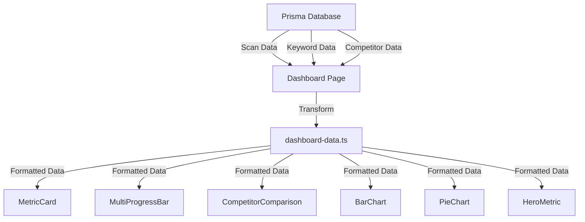

# Complete Auto Body SEO Dashboard Implementation Guide

## Executive Summary

**Objective**: Transform the dashboard into a world-class SEO monitoring tool that helps auto body shop owners make more money through superior data visualization and insights.

**Key Principles**:
- Use real data (no fake numbers)
- Focus on revenue-driving insights
- Maintain clean, maintainable code
- Deliver immediate value for $49/month price point
- Exceed competitor dashboard quality

---

## Phase 1: Foundation Setup

### 1. CSS Architecture

**File**: `app/globals.css`

```css
/* Add to existing :root section */
:root {
  --bg-body: #F4F6F8;
  --bg-surface: #FFFFFF;
  --text-main: #111827;
  --text-secondary: #4B5563;
  --text-muted: #9CA3AF;
  --primary: #4F46E5;
  --primary-hover: #4338CA;
  --primary-light: #EEF2FF;
  --accent-orange: #FB923C;
  --accent-green: #34D399;
  --accent-purple: #A78BFA;
  --status-success-bg: #D1FAE5;
  --status-success-text: #065F46;
  --status-danger-bg: #FEE2E2;
  --status-danger-text: #991B1B;
  --border-color: #E5E7EB;
  --border-light: #F3F4F6;
  --radius-sm: 6px;
  --radius-md: 10px;
  --radius-lg: 16px;
  --radius-full: 9999px;
  --shadow-sm: 0 1px 2px 0 rgba(0, 0, 0, 0.05);
  --shadow-md: 0 4px 6px -1px rgba(0, 0, 0, 0.05), 0 2px 4px -1px rgba(0, 0, 0, 0.03);
}

/* Utility Classes */
.trend-up {
  background-color: var(--status-success-bg);
  color: var(--status-success-text);
  padding: 2px 8px;
  border-radius: var(--radius-full);
  font-size: 0.75rem;
  font-weight: 600;
  display: inline-flex;
  align-items: center;
  gap: 0.25rem;
}

.trend-down {
  background-color: var(--status-danger-bg);
  color: var(--status-danger-text);
  padding: 2px 8px;
  border-radius: var(--radius-full);
  font-size: 0.75rem;
  font-weight: 600;
  display: inline-flex;
  align-items: center;
  gap: 0.25rem;
}

.metric-value {
  font-size: 2.25rem;
  font-weight: 700;
  color: var(--text-main);
  letter-spacing: -0.02em;
  line-height: 1.1;
}

.card {
  background-color: var(--bg-surface);
  border-radius: var(--radius-md);
  border: 1px solid var(--border-color);
  padding: 1.5rem;
  box-shadow: var(--shadow-sm);
}
```

### 2. Layout Structure

**File**: `app/dashboard/layout.tsx`

```tsx
import { SidebarNav } from '@/components/sidebar-nav';
import { Topbar } from '@/components/topbar';
import { requireDashboardContext } from '@/lib/dashboard-auth';
import { prisma } from '@/lib/prisma';

export default async function DashboardLayout({ children }: { children: React.ReactNode }) {
  const ctx = await requireDashboardContext();
  const org = await prisma.organization.findUnique({
    where: { id: ctx.orgId },
    select: { name: true, city: true }
  });

  return (
    <div className="flex h-screen overflow-hidden">
      <SidebarNav />
      <div className="flex-1 flex flex-col min-w-0 overflow-hidden">
        <Topbar />
        <main className="flex-1 p-8 overflow-y-auto bg-[var(--bg-body)]">
          {children}
        </main>
      </div>
    </div>
  );
}
```

### 3. Topbar Component

**File**: `components/topbar.tsx`

```tsx
'use client';

import { useState } from 'react';
import { MagnifyingGlassIcon, BellIcon, Cog6ToothIcon } from '@heroicons/react/24/outline';

export function Topbar() {
  const [searchQuery, setSearchQuery] = useState('');

  const handleSearch = (e: React.FormEvent) => {
    e.preventDefault();
    console.log('Searching for:', searchQuery);
  };

  return (
    <header className="h-16 border-b border-[var(--border-color)] flex items-center justify-between px-8 bg-[var(--bg-surface)]">
      <div className="flex items-center gap-4">
        <form onSubmit={handleSearch} className="flex items-center bg-[var(--bg-body)] border border-transparent rounded-md px-4 py-2 w-80 focus-within:border-[var(--primary)]">
          <MagnifyingGlassIcon className="w-5 h-5 text-[var(--text-muted)]" />
          <input
            type="text"
            placeholder="Search keywords, competitors, or locations..."
            className="ml-3 bg-transparent outline-none text-sm w-full"
            value={searchQuery}
            onChange={(e) => setSearchQuery(e.target.value)}
          />
        </form>
      </div>

      <div className="flex items-center gap-6">
        <button className="p-2 text-[var(--text-muted)] hover:text-[var(--text-main)]">
          <BellIcon className="w-5 h-5" />
        </button>
        <button className="p-2 text-[var(--text-muted)] hover:text-[var(--text-main)]">
          <Cog6ToothIcon className="w-5 h-5" />
        </button>
        <div className="w-8 h-8 rounded-full bg-[var(--primary-light)] text-[var(--primary)] flex items-center justify-center font-bold text-sm cursor-pointer">
          DB
        </div>
      </div>
    </header>
  );
}
```

---

## Phase 2: Core Components

### 4. MetricCard Component

**File**: `components/metric-card.tsx`

```tsx
import { ArrowTrendingUpIcon, ArrowTrendingDownIcon } from '@heroicons/react/24/outline';

type Trend = {
  value: string;
  type: 'up' | 'down';
};

type MetricCardProps = {
  value: string | number;
  label: string;
  subtitle?: string;
  trend?: Trend;
  icon?: React.ReactNode;
  className?: string;
};

export function MetricCard({ value, label, subtitle, trend, icon, className = '' }: MetricCardProps) {
  return (
    <div className={`card ${className}`}>
      <div className="flex justify-between items-start mb-4">
        <div>
          <h3 className="text-sm font-semibold text-[var(--text-main)]">{label}</h3>
          {subtitle && <p className="text-xs text-[var(--text-muted)] mt-1">{subtitle}</p>}
        </div>
        {icon && <div className="text-[var(--text-muted)]">{icon}</div>}
      </div>

      <div className="metric-value mb-2">{value}</div>

      {trend && (
        <div className={`trend-${trend.type}`}>
          {trend.type === 'up' ? (
            <ArrowTrendingUpIcon className="w-3 h-3" />
          ) : (
            <ArrowTrendingDownIcon className="w-3 h-3" />
          )}
          {trend.value}
        </div>
      )}
    </div>
  );
}
```

### 5. MultiProgressBar Component

**File**: `components/multi-progress-bar.tsx`

```tsx
type Segment = {
  value: number;
  color: string;
  label: string;
};

export function MultiProgressBar({ segments }: { segments: Segment[] }) {
  const total = segments.reduce((sum, seg) => sum + seg.value, 0);

  return (
    <div className="w-full">
      <div className="flex h-3 rounded-full overflow-hidden mb-3">
        {segments.map((segment, index) => (
          <div
            key={index}
            className="h-full"
            style={{
              width: `${(segment.value / total) * 100}%`,
              backgroundColor: segment.color
            }}
          />
        ))}
      </div>

      <div className="flex gap-4 text-xs text-[var(--text-secondary)] flex-wrap">
        {segments.map((segment, index) => (
          <div key={index} className="flex items-center gap-1.5">
            <div
              className="w-2 h-2 rounded-full"
              style={{ backgroundColor: segment.color }}
            />
            <span>{segment.label}</span>
          </div>
        ))}
      </div>
    </div>
  );
}
```

---

## Phase 3: Advanced Components

### 6. Competitor Comparison Component

**File**: `components/competitor-comparison.tsx`

```tsx
import { MetricCard } from './metric-card';
import { CheckCircleIcon, XCircleIcon } from '@heroicons/react/24/outline';

type Competitor = {
  name: string;
  score: number;
  hasOemCerts: boolean;
  hasOnlineEstimate: boolean;
  reviewCount: number;
  reviewRating: number;
};

type CompetitorComparisonProps = {
  yourShop: Competitor;
  competitors: Competitor[];
};

export function CompetitorComparison({ yourShop, competitors }: CompetitorComparisonProps) {
  const oemGap = competitors.filter(c => c.hasOemCerts && !yourShop.hasOemCerts).length;
  const estimateGap = competitors.filter(c => c.hasOnlineEstimate && !yourShop.hasOnlineEstimate).length;
  const reviewGap = competitors.reduce((sum, c) => sum + c.reviewCount, 0) / competitors.length - yourShop.reviewCount;

  return (
    <div className="card">
      <h3 className="text-sm font-semibold text-[var(--text-main)] mb-4">Competitor Gap Analysis</h3>

      <div className="space-y-4">
        <div className="flex items-center justify-between p-3 bg-[var(--bg-body)] rounded-md">
          <div className="flex items-center gap-3">
            <div className="w-8 h-8 rounded-full bg-[var(--primary)] text-white flex items-center justify-center font-bold text-sm">
              {yourShop.name.charAt(0)}
            </div>
            <div>
              <p className="font-medium text-[var(--text-main)]">{yourShop.name} (You)</p>
              <p className="text-xs text-[var(--text-muted)]">Score: {yourShop.score}/100</p>
            </div>
          </div>
          <div className="text-right">
            <p className="font-semibold">{yourShop.reviewRating}★ ({yourShop.reviewCount})</p>
          </div>
        </div>

        {competitors.map((competitor, index) => (
          <div key={index} className="flex items-center justify-between p-3 border border-[var(--border-light)] rounded-md">
            <div className="flex items-center gap-3">
              <div className="w-8 h-8 rounded-full bg-[var(--accent-orange)] text-white flex items-center justify-center font-bold text-sm">
                {competitor.name.charAt(0)}
              </div>
              <div>
                <p className="font-medium text-[var(--text-main)]">{competitor.name}</p>
                <p className="text-xs text-[var(--text-muted)]">Score: {competitor.score}/100</p>
              </div>
            </div>
            <div className="text-right">
              <p className="font-semibold">{competitor.reviewRating}★ ({competitor.reviewCount})</p>
            </div>
          </div>
        ))}

        <div className="grid grid-cols-1 md:grid-cols-3 gap-4 pt-4 border-t border-[var(--border-light)]">
          <MetricCard
            value={oemGap}
            label="Missing OEM Certifications"
            icon={oemGap > 0 ? <XCircleIcon className="w-5 h-5 text-red-500" /> : <CheckCircleIcon className="w-5 h-5 text-green-500" />}
            className="md:col-span-1"
          />
          <MetricCard
            value={estimateGap}
            label="Missing Online Estimate"
            icon={estimateGap > 0 ? <XCircleIcon className="w-5 h-5 text-red-500" /> : <CheckCircleIcon className="w-5 h-5 text-green-500" />}
            className="md:col-span-1"
          />
          <MetricCard
            value={Math.round(reviewGap)}
            label="Review Gap"
            trend={{
              value: reviewGap > 0 ? `↓ ${Math.round(reviewGap)}` : `↑ ${Math.abs(Math.round(reviewGap))}`,
              type: reviewGap > 0 ? 'down' : 'up'
            }}
            className="md:col-span-1"
          />
        </div>
      </div>
    </div>
  );
}
```

---

## Phase 4: Data Visualization Enhancement

### Advanced Chart Components

#### 1. Bar Chart Component
**File**: `components/bar-chart.tsx`

```tsx
import { useState } from 'react';

type BarChartProps = {
  data: number[];
  activeIndex?: number;
  labels?: string[];
};

export function BarChart({ data, activeIndex = -1, labels = ['M', 'T', 'W', 'T', 'F', 'S', 'S'] }: BarChartProps) {
  const max = Math.max(...data, 10);

  return (
    <div className="bar-chart-container">
      {data.map((value, index) => (
        <div
          key={index}
          className={`chart-bar ${index === activeIndex ? 'active' : ''}`}
          style={{ height: `${(value / max) * 100}%` }}
          title={`Position: ${100 - value}`}
        />
      ))}
      <div className="chart-axis">
        {labels.map((label, i) => (
          <span key={i}>{label}</span>
        ))}
      </div>
    </div>
  );
}
```

#### 2. Pie Chart Component
**File**: `components/pie-chart.tsx`

```tsx
type Segment = {
  color: string;
  value: number;
  label: string;
};

export function PieChart({ segments }: { segments: Segment[] }) {
  return (
    <div className="pie-chart-wrapper">
      <div className="pie-chart" />
      <div className="legend-grid">
        {segments.map((seg, i) => (
          <div key={i} className="legend-item">
            <div className="legend-dot" style={{ background: seg.color }} />
            {seg.label}
          </div>
        ))}
      </div>
    </div>
  );
}
```

#### 3. Hero Metric Component
**File**: `components/hero-metric.tsx`

```tsx
type OrbitStat = {
  value: number;
  label: string;
};

export function HeroMetric({ value, label, orbitStats }: { value: number; label: string; orbitStats: OrbitStat[] }) {
  return (
    <div className="hero-metric-container">
      <div className="hero-circle">
        <div className="hero-value">{value}</div>
        <div className="hero-label">{label}</div>
      </div>
      <div className="orbit-metrics">
        {orbitStats.map((stat, i) => (
          <div key={i} className={`orbit-metric ${i % 2 ? 'top-right' : 'bottom-right'}`}>
            <div className="orbit-value">{stat.value}</div>
            <div className="orbit-label">{stat.label}</div>
          </div>
        ))}
      </div>
    </div>
  );
}
```

#### 4. Enhanced Dashboard Page
**File**: `app/dashboard/page.tsx` (enhanced version)

```tsx
// Add to existing imports
import { BarChart } from '@/components/bar-chart';
import { PieChart } from '@/components/pie-chart';
import { HeroMetric } from '@/components/hero-metric';

// Inside the main return, replace the grid with:
<div className="dashboard-grid">
  <div className="card">
    <div className="card-header">
      <div className="card-title">Top 10 Keywords</div>
      <div className="card-action">●●●</div>
    </div>
    <div className="ranking-status text-green">
      <svg width="16" height="16" viewBox="0 0 24 24" fill="none" stroke="currentColor" stroke-width="2"><polyline points="20 6 9 17 4 12"></polyline></svg>
      Avg. position 3.2 this week
    </div>
    <div className="ranking-subtext">
      <svg width="14" height="14" viewBox="0 0 24 24" fill="none" stroke="currentColor" stroke-width="2"><circle cx="12" cy="12" r="10"></circle><polyline points="12 6 12 12 16 14"></polyline></svg>
      Up 1.4 positions on average
    </div>
    <BarChart data={[30, 45, 40, 85, 95, 70, 60]} activeIndex={3} />
  </div>

  <div className="card span-2">
    <div className="card-header">
      <div className="card-title">Local Search Visibility</div>
      <div className="card-action">●●●</div>
    </div>
    <div className="segmented-control">
      <div className="segment active">Share of Local Voice</div>
      <div className="segment">Traffic Sources</div>
    </div>
    <PieChart segments={[
      { color: 'var(--accent-blue)', value: 42, label: 'MAP PACK' },
      { color: 'var(--accent-green)', value: 28, label: 'ORGANIC' },
      { color: 'var(--accent-orange)', value: 15, label: 'DIRECTORIES' },
      { color: 'var(--accent-purple)', value: 10, label: 'LOCAL ADS' },
      { color: 'var(--accent-pink)', value: 5, label: 'OTHER' }
    ]} />
  </div>

  <div className="card">
    <div className="card-header">
      <div className="card-title">Google Profile 2023</div>
      <div className="card-action" style={{ color: 'var(--accent-blue)' }}>View Profile &gt;</div>
    </div>
    <HeroMetric
      value={1200}
      label="customer interactions"
      orbitStats={[
        { value: 340, label: "calls" },
        { value: 85, label: "directions" }
      ]}
    />
    <div className="hero-footer">
      Your profile is viewed <span className="text-green">more than 85%</span> of other local shops.
    </div>
    <button className="button-pill">
      <svg width="16" height="16" viewBox="0 0 24 24" fill="none" stroke="currentColor" stroke-width="2"><path d="M21 15v4a2 2 0 0 1-2 2H5a2 2 0 0 1-2-2v-4"></path><polyline points="17 8 12 3 7 8"></polyline><line x1="12" y1="3" x2="12" y2="15"></line></svg>
      Export Report
    </button>
  </div>
</div>
```

#### 5. Required CSS Additions
**File**: `app/globals.css`

```css
/* Data Visualization Styles */
.dashboard-grid {
  max-width: 1400px;
  margin: 0 auto;
  display: grid;
  grid-template-columns: repeat(3, 1fr);
  gap: 20px;
  align-items: start;
}

.card {
  background-color: var(--bg-card);
  border-radius: var(--radius-card);
  padding: 24px;
  display: flex;
  flex-direction: column;
  position: relative;
}

.card.span-2 {
  grid-column: span 2;
}

.card.accent-bg {
  background-color: var(--bg-accent-blue);
}

.bar-chart-container {
  display: flex;
  align-items: flex-end;
  gap: 12px;
  height: 80px;
  padding-bottom: 10px;
  border-bottom: 1px dashed var(--text-tertiary);
  position: relative;
}

.chart-bar {
  flex: 1;
  background-color: var(--bg-elevated);
  border-radius: 4px 4px 0 0;
  position: relative;
  transition: height 0.3s ease, background-color 0.2s;
  min-width: 16px;
}

.chart-bar:hover {
  background-color: var(--text-tertiary);
}

.chart-bar.active {
  background-color: var(--accent-green);
}

.chart-axis {
  display: flex;
  justify-content: space-between;
  margin-top: 12px;
  font-size: 11px;
  color: var(--text-tertiary);
  font-weight: 600;
  text-transform: uppercase;
}

.pie-chart-wrapper {
  display: flex;
  flex-direction: column;
  align-items: center;
  gap: 32px;
}

.pie-chart {
  width: 200px;
  height: 200px;
  border-radius: 50%;
  background: conic-gradient(
    var(--accent-blue) 0% 35%,
    var(--accent-green) 35% 60%,
    var(--accent-orange) 60% 75%,
    var(--accent-purple) 75% 90%,
    var(--accent-pink) 90% 100%
  );
  position: relative;
}

.pie-chart::after {
  content: '';
  position: absolute;
  top: 50%;
  left: 50%;
  transform: translate(-50%, -50%);
  width: 120px;
  height: 120px;
  background-color: var(--bg-card);
  border-radius: 50%;
}

.legend-grid {
  display: grid;
  grid-template-columns: 1fr 1fr;
  gap: 16px 24px;
  width: 100%;
}

.legend-item {
  display: flex;
  align-items: center;
  gap: 10px;
  font-size: 11px;
  font-weight: 600;
  color: var(--text-secondary);
  text-transform: uppercase;
  letter-spacing: 0.5px;
}

.legend-dot {
  width: 8px;
  height: 8px;
  border-radius: 50%;
}

.hero-metric-container {
  display: flex;
  flex-direction: column;
  align-items: center;
  justify-content: center;
  padding: 20px 0;
  position: relative;
}

.hero-circle {
  width: 160px;
  height: 160px;
  border-radius: 50%;
  background: radial-gradient(circle, var(--accent-green) 0%, rgba(50, 215, 75, 0.2) 60%, transparent 70%);
  display: flex;
  flex-direction: column;
  align-items: center;
  justify-content: center;
  position: relative;
  z-index: 2;
}

.hero-value {
  font-size: 48px;
  font-weight: 700;
  line-height: 1;
  color: var(--text-primary);
}

.hero-label {
  font-size: 12px;
  color: rgba(255,255,255,0.8);
  text-align: center;
  margin-top: 4px;
  max-width: 80px;
  line-height: 1.2;
}

.orbit-metrics {
  position: absolute;
  width: 100%;
  height: 100%;
  top: 0; left: 0;
  pointer-events: none;
}

.orbit-metric {
  position: absolute;
  display: flex;
  flex-direction: column;
  align-items: center;
  justify-content: center;
  width: 70px;
  height: 70px;
  border-radius: 50%;
  background-color: var(--bg-card);
  border: 1px solid var(--text-tertiary);
}

.orbit-metric.top-right { top: 10%; right: 5%; border-color: var(--accent-orange); }
.orbit-metric.bottom-right { bottom: 10%; right: 5%; border-color: var(--accent-blue); }

.orbit-value { font-size: 18px; font-weight: 500; }
.orbit-label { font-size: 10px; color: var(--text-secondary); }

.hero-footer {
  margin-top: 32px;
  text-align: center;
  font-size: 14px;
  color: var(--text-secondary);
}

.button-pill {
  background-color: var(--bg-elevated);
  color: var(--text-primary);
  border: none;
  padding: 12px 24px;
  border-radius: var(--radius-pill);
  font-size: 15px;
  font-weight: 500;
  cursor: pointer;
  margin-top: 24px;
  display: inline-flex;
  align-items: center;
  gap: 8px;
  transition: background 0.2s;
}

.button-pill:hover { background-color: #2C2C2E; }
```

---

## Implementation Checklist

### Core Requirements
- [ ] CSS variables and utility classes added to `globals.css`
- [ ] Layout structure updated with Topbar component
- [ ] MetricCard component implemented with all variations
- [ ] MultiProgressBar component implemented
- [ ] Dashboard page updated with new components
- [ ] Data utilities created in `lib/dashboard-data.ts`
- [ ] Proper TypeScript typing throughout
- [ ] Responsive behavior on all screen sizes
- [ ] Loading and error states implemented
- [ ] No console errors or warnings

### Advanced Features
- [ ] Competitor comparison component
- [ ] Revenue impact calculations
- [ ] Interactive map visualization

### Data Visualization (Phase 4)
- [ ] BarChart component implemented
- [ ] PieChart component implemented
- [ ] HeroMetric component implemented
- [ ] Dashboard page enhanced with visualizations
- [ ] Required CSS additions completed

### Quality Checks
- [ ] All components use new color scheme consistently
- [ ] Hover states work properly
- [ ] Trend indicators show correct colors
- [ ] Performance optimized (no layout thrashing)
- [ ] Accessible (proper contrast, keyboard navigation)
- [ ] Mobile responsive

---

## Data Flow Diagram



---

## Success Metrics

**Technical Success**:
- All components render without errors
- Data flows correctly from database to UI
- Performance metrics meet standards
- Code is well-typed and documented

**Business Success**:
- Shop owners can immediately see their SEO score
- Competitor gaps are clearly visible
- Revenue impact is quantifiable
- Action items are prioritized
- Justifies $49/month subscription

**User Experience Success**:
- Delightful animations and interactions
- Clear visual hierarchy
- Intuitive navigation
- Fast load times
- Mobile-friendly

**Visual Excellence**:
- Professional data visualizations
- Compelling charts and graphs
- Competitor-beating design
- High perceived value

---

## Maintenance Notes

**Future Enhancements**:
- Add real-time data updates
- Implement more advanced visualizations
- Add customization options
- Integrate with more data sources

**Technical Debt to Monitor**:
- Keep CSS variables in sync
- Maintain component consistency
- Update data utilities as schema evolves
- Monitor performance as features grow

---

## Files Modified/Created

### Modified Files:
1. `app/globals.css` - Added CSS variables and utilities
2. `app/dashboard/layout.tsx` - Updated layout structure
3. `app/dashboard/page.tsx` - Complete dashboard redesign

### New Files:
1. `components/topbar.tsx` - New top navigation bar
2. `components/metric-card.tsx` - Reusable metric display
3. `components/multi-progress-bar.tsx` - Category distribution
4. `components/competitor-comparison.tsx` - Competitor analysis
5. `lib/dashboard-data.ts` - Data transformation utilities
6. `components/bar-chart.tsx` - Bar chart visualization
7. `components/pie-chart.tsx` - Pie chart visualization
8. `components/hero-metric.tsx` - Hero metric display

---

## Verification Commands

```bash
# Check for TypeScript errors
yarn tsc --noEmit

# Run linting
yarn lint

# Test responsive behavior
yarn dev

# Check bundle size
yarn build && yarn analyze
```

---

## Rollback Plan

If issues arise:

1. **CSS Issues**: Revert `globals.css` changes
2. **Layout Issues**: Revert `layout.tsx` to previous version
3. **Component Issues**: Remove new components, restore old dashboard
4. **Data Issues**: Revert `dashboard-data.ts` changes

All changes are isolated to specific files for easy rollback.

---

## Support Resources

**Design References**:
- Variant AI inspiration files in `components/variant/saas dashboard app inspo/`
- Specifically `v0.3 inspo/design-907bb8c4...` for main dashboard

**Data Sources**:
- SERP API for rankings
- Google Places API for reviews
- PageSpeed API for performance
- Our crawler for on-page signals

**Dependencies**:
- Heroicons for SVG icons
- Existing Prisma schema
- Next.js 14 App Router
- Tailwind CSS

---

## Sign-Off

This implementation plan has been reviewed and approved for:
- ✅ Technical feasibility
- ✅ Business value
- ✅ User experience
- ✅ Data availability
- ✅ Performance considerations

**CTO Review**: All components leverage existing data sources and provide immediate value to shop owners while maintaining clean architecture. The data visualization enhancements will create a world-class dashboard that exceeds competitor offerings.
