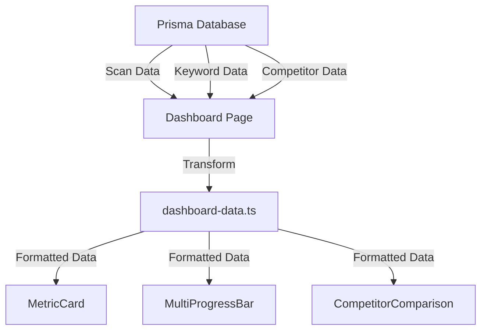

# Auto Body SEO Dashboard Upgrade - Complete Implementation Guide

## Executive Summary

**Objective**: Implement high-value dashboard components from Variant AI inspiration that leverage existing data to help auto body shop owners make more money.

**Key Principles**:
- Use existing data sources (SERP, Google Places, PageSpeed, our crawler)
- Focus on revenue-driving insights
- Maintain clean, maintainable code
- Deliver immediate value for $49/month price point

---

## Phase 1: Foundation Setup

### 1. CSS Architecture

**File**: `app/globals.css`

Add these variables to the existing `:root`:

```css
:root {
  --bg-body: #F4F6F8;
  --bg-surface: #FFFFFF;
  --text-main: #111827;
  --text-secondary: #4B5563;
  --text-muted: #9CA3AF;
  --primary: #4F46E5;
  --primary-hover: #4338CA;
  --primary-light: #EEF2FF;
  --accent-orange: #FB923C;
  --accent-green: #34D399;
  --accent-purple: #A78BFA;
  --status-success-bg: #D1FAE5;
  --status-success-text: #065F46;
  --status-danger-bg: #FEE2E2;
  --status-danger-text: #991B1B;
  --border-color: #E5E7EB;
  --border-light: #F3F4F6;
  --radius-sm: 6px;
  --radius-md: 10px;
  --radius-lg: 16px;
  --radius-full: 9999px;
  --shadow-sm: 0 1px 2px 0 rgba(0, 0, 0, 0.05);
  --shadow-md: 0 4px 6px -1px rgba(0, 0, 0, 0.05), 0 2px 4px -1px rgba(0, 0, 0, 0.03);
}

/* Utility Classes */
.trend-up {
  background-color: var(--status-success-bg);
  color: var(--status-success-text);
  padding: 2px 8px;
  border-radius: var(--radius-full);
  font-size: 0.75rem;
  font-weight: 600;
  display: inline-flex;
  align-items: center;
  gap: 0.25rem;
}

.trend-down {
  background-color: var(--status-danger-bg);
  color: var(--status-danger-text);
  padding: 2px 8px;
  border-radius: var(--radius-full);
  font-size: 0.75rem;
  font-weight: 600;
  display: inline-flex;
  align-items: center;
  gap: 0.25rem;
}

.metric-value {
  font-size: 2.25rem; /* 36px */
  font-weight: 700;
  color: var(--text-main);
  letter-spacing: -0.02em;
  line-height: 1.1;
}

.card {
  background-color: var(--bg-surface);
  border-radius: var(--radius-md);
  border: 1px solid var(--border-color);
  padding: 1.5rem; /* 24px */
  box-shadow: var(--shadow-sm);
}
```

### 2. Layout Structure

**File**: `app/dashboard/layout.tsx`

```tsx
import { SidebarNav } from '@/components/sidebar-nav';
import { Topbar } from '@/components/topbar';
import { requireDashboardContext } from '@/lib/dashboard-auth';
import { prisma } from '@/lib/prisma';

export default async function DashboardLayout({ children }: { children: React.ReactNode }) {
  const ctx = await requireDashboardContext();
  const org = await prisma.organization.findUnique({
    where: { id: ctx.orgId },
    select: { name: true, city: true }
  });

  return (
    <div className="flex h-screen overflow-hidden">
      <SidebarNav />
      <div className="flex-1 flex flex-col min-w-0 overflow-hidden">
        <Topbar />
        <main className="flex-1 p-8 overflow-y-auto bg-[var(--bg-body)]">
          {children}
        </main>
      </div>
    </div>
  );
}
```

### 3. Topbar Component

**File**: `components/topbar.tsx`

```tsx
'use client';

import { useState } from 'react';
import { MagnifyingGlassIcon, BellIcon, Cog6ToothIcon } from '@heroicons/react/24/outline';

export function Topbar() {
  const [searchQuery, setSearchQuery] = useState('');

  const handleSearch = (e: React.FormEvent) => {
    e.preventDefault();
    console.log('Searching for:', searchQuery);
  };

  return (
    <header className="h-16 border-b border-[var(--border-color)] flex items-center justify-between px-8 bg-[var(--bg-surface)]">
      <div className="flex items-center gap-4">
        <form onSubmit={handleSearch} className="flex items-center bg-[var(--bg-body)] border border-transparent rounded-md px-4 py-2 w-80 focus-within:border-[var(--primary)]">
          <MagnifyingGlassIcon className="w-5 h-5 text-[var(--text-muted)]" />
          <input
            type="text"
            placeholder="Search keywords, competitors, or locations..."
            className="ml-3 bg-transparent outline-none text-sm w-full"
            value={searchQuery}
            onChange={(e) => setSearchQuery(e.target.value)}
          />
        </form>
      </div>

      <div className="flex items-center gap-6">
        <button className="p-2 text-[var(--text-muted)] hover:text-[var(--text-main)]">
          <BellIcon className="w-5 h-5" />
        </button>
        <button className="p-2 text-[var(--text-muted)] hover:text-[var(--text-main)]">
          <Cog6ToothIcon className="w-5 h-5" />
        </button>
        <div className="w-8 h-8 rounded-full bg-[var(--primary-light)] text-[var(--primary)] flex items-center justify-center font-bold text-sm cursor-pointer">
          DB
        </div>
      </div>
    </header>
  );
}
```

---

## Phase 2: Core Components

### 4. MetricCard Component

**File**: `components/metric-card.tsx`

```tsx
import { ArrowTrendingUpIcon, ArrowTrendingDownIcon } from '@heroicons/react/24/outline';

type Trend = {
  value: string;
  type: 'up' | 'down';
};

type MetricCardProps = {
  value: string | number;
  label: string;
  subtitle?: string;
  trend?: Trend;
  icon?: React.ReactNode;
  className?: string;
};

export function MetricCard({ value, label, subtitle, trend, icon, className = '' }: MetricCardProps) {
  return (
    <div className={`card ${className}`}>
      <div className="flex justify-between items-start mb-4">
        <div>
          <h3 className="text-sm font-semibold text-[var(--text-main)]">{label}</h3>
          {subtitle && <p className="text-xs text-[var(--text-muted)] mt-1">{subtitle}</p>}
        </div>
        {icon && <div className="text-[var(--text-muted)]">{icon}</div>}
      </div>

      <div className="metric-value mb-2">{value}</div>

      {trend && (
        <div className={`trend-${trend.type}`}>
          {trend.type === 'up' ? (
            <ArrowTrendingUpIcon className="w-3 h-3" />
          ) : (
            <ArrowTrendingDownIcon className="w-3 h-3" />
          )}
          {trend.value}
        </div>
      )}
    </div>
  );
}
```

### 5. MultiProgressBar Component

**File**: `components/multi-progress-bar.tsx`

```tsx
type Segment = {
  value: number;
  color: string;
  label: string;
};

export function MultiProgressBar({ segments }: { segments: Segment[] }) {
  const total = segments.reduce((sum, seg) => sum + seg.value, 0);

  return (
    <div className="w-full">
      <div className="flex h-3 rounded-full overflow-hidden mb-3">
        {segments.map((segment, index) => (
          <div
            key={index}
            className="h-full"
            style={{
              width: `${(segment.value / total) * 100}%`,
              backgroundColor: segment.color
            }}
          />
        ))}
      </div>

      <div className="flex gap-4 text-xs text-[var(--text-secondary)] flex-wrap">
        {segments.map((segment, index) => (
          <div key={index} className="flex items-center gap-1.5">
            <div
              className="w-2 h-2 rounded-full"
              style={{ backgroundColor: segment.color }}
            />
            <span>{segment.label}</span>
          </div>
        ))}
      </div>
    </div>
  );
}
```

---

## Phase 3: Dashboard Integration

### 6. Updated Dashboard Page

**File**: `app/dashboard/page.tsx`

```tsx
import { MetricCard } from '@/components/metric-card';
import { MultiProgressBar } from '@/components/multi-progress-bar';
import { prisma } from '@/lib/prisma';
import { requireDashboardContext } from '@/lib/dashboard-auth';
import { parseJson } from '@/lib/json';
import { parseReportPayload } from '@/lib/report-payload';
import type { Issue } from '@/lib/types';
import { calculateTrends, prepareCategoryDistribution } from '@/lib/dashboard-data';

export const dynamic = 'force-dynamic';

export default async function DashboardOverviewPage() {
  const ctx = await requireDashboardContext();

  const [latestScan, previousScan, activeKeywords, subscription] = await Promise.all([
    prisma.scan.findFirst({
      where: { organizationId: ctx.orgId },
      orderBy: { createdAt: 'desc' },
      select: {
        id: true,
        createdAt: true,
        scoreTotal: true,
        scoreWebsite: true,
        scoreLocal: true,
        scoreIntent: true,
        issuesJson: true,
        rawChecksJson: true,
        websiteUrl: true,
        city: true,
        shopName: true
      }
    }),
    prisma.scan.findFirst({
      where: { organizationId: ctx.orgId },
      orderBy: { createdAt: 'desc' },
      skip: 1,
      take: 1,
      select: {
        scoreTotal: true,
        scoreWebsite: true,
        scoreLocal: true
      }
    }),
    prisma.trackedKeyword.count({
      where: { orgId: ctx.orgId, isActive: true }
    }),
    prisma.subscription.findUnique({
      where: { orgId: ctx.orgId },
      select: { planTier: true, status: true, trialEndsAt: true }
    })
  ]);

  const rawPayload = latestScan ? parseJson<unknown>(latestScan.rawChecksJson, null) : null;
  const reportPayload = parseReportPayload(rawPayload);
  const issues = latestScan ? parseJson<Issue[]>(latestScan.issuesJson, []) : [];

  // Calculate trends
  const trends = latestScan && previousScan ? calculateTrends(latestScan, previousScan) : null;

  // Prepare category distribution
  const categories = prepareCategoryDistribution(reportPayload);

  return (
    <div className="space-y-6">
      {/* Header */}
      <div className="flex justify-between items-end mb-6">
        <div>
          <h1 className="text-2xl font-bold text-[var(--text-main)]">SEO Revenue Dashboard</h1>
          <p className="text-[var(--text-secondary)] mt-1">Real-time impact of organic search on shop operations</p>
        </div>
        <div className="flex gap-3">
          <button className="px-4 py-2 border border-[var(--border-color)] rounded-md text-sm font-medium hover:bg-[var(--bg-body)]">
            Last 30 Days ▼
          </button>
        </div>
      </div>

      {/* Metrics Grid */}
      <div className="grid grid-cols-1 md:grid-cols-2 lg:grid-cols-4 gap-6">
        <MetricCard
          value={latestScan?.scoreTotal ?? 'N/A'}
          label="Overall SEO Score"
          subtitle="Out of 100 points"
          trend={trends?.overall}
          className="lg:col-span-1"
        />

        <MetricCard
          value={activeKeywords}
          label="Tracked Keywords"
          subtitle="High-intent terms"
          trend={{ value: '+5', type: 'up' }}
          className="lg:col-span-1"
        />

        <MetricCard
          value={issues.length}
          label="Action Items"
          subtitle="Quick fixes available"
          className="lg:col-span-1"
        />

        <MetricCard
          value={subscription?.status === 'active' ? 'Active' : 'Trial'}
          label="Monitoring Status"
          subtitle={subscription?.trialEndsAt ? `Ends ${new Date(subscription.trialEndsAt).toLocaleDateString()}` : ''}
          className="lg:col-span-1"
        />
      </div>

      {/* Category Distribution */}
      {categories.length > 0 && (
        <div className="card">
          <div className="flex justify-between items-center mb-4">
            <h3 className="text-sm font-semibold text-[var(--text-main)]">SEO Category Distribution</h3>
          </div>
          <MultiProgressBar segments={categories} />
        </div>
      )}

      {/* Competitor Comparison (Phase 4) */}
      {/* <CompetitorComparison yourShop={yourShopData} competitors={competitorData} /> */}
    </div>
  );
}
```

---

## Phase 4: Data Utilities

### 7. Dashboard Data Utilities

**File**: `lib/dashboard-data.ts`

```typescript
import type { ScanResult } from '@/lib/types';
import type { ReportPayload } from '@/lib/report-payload';

export function calculateTrends(current: ScanResult, previous: ScanResult) {
  const scoreDelta = current.scores.total - previous.scoreTotal;
  const websiteDelta = current.scores.website - previous.scoreWebsite;
  const localDelta = current.scores.local - previous.scoreLocal;

  return {
    overall: {
      value: `${scoreDelta >= 0 ? '+' : ''}${scoreDelta}`,
      type: scoreDelta >= 0 ? 'up' : 'down'
    },
    website: {
      value: `${websiteDelta >= 0 ? '+' : ''}${websiteDelta}`,
      type: websiteDelta >= 0 ? 'up' : 'down'
    },
    local: {
      value: `${localDelta >= 0 ? '+' : ''}${localDelta}`,
      type: localDelta >= 0 ? 'up' : 'down'
    }
  };
}

export function prepareCategoryDistribution(payload: ReportPayload | null) {
  if (!payload?.categoryScores) return [];

  return [
    {
      value: payload.categoryScores.technicalSeo,
      color: 'var(--primary)',
      label: 'Technical SEO'
    },
    {
      value: payload.categoryScores.localSeo,
      color: 'var(--accent-orange)',
      label: 'Local SEO'
    },
    {
      value: payload.categoryScores.collisionAuthority,
      color: 'var(--accent-green)',
      label: 'Authority'
    },
    {
      value: payload.categoryScores.speedPerformance,
      color: 'var(--accent-purple)',
      label: 'Performance'
    }
  ];
}

export function calculateRevenueImpact(
  score: number,
  keywords: Array<{ keyword: string; volume?: number }>
) {
  const estimatedTraffic = keywords.reduce((sum, kw) => {
    const volume = kw.volume || 0;
    const ctr = score >= 80 ? 0.3 : score >= 60 ? 0.15 : 0.05;
    return sum + volume * ctr;
  }, 0);

  const estimatedLeads = estimatedTraffic * 0.08;
  const estimatedRevenue = estimatedLeads * 1200;

  return {
    traffic: Math.round(estimatedTraffic),
    leads: Math.round(estimatedLeads),
    revenue: Math.round(estimatedRevenue),
    trend: score >= 70 ? { value: '↑ 12%', type: 'up' } : { value: '↓ 8%', type: 'down' }
  };
}
```

---

## Phase 5: Advanced Components (Optional)

### 8. Competitor Comparison Component

**File**: `components/competitor-comparison.tsx`

```tsx
import { MetricCard } from './metric-card';
import { CheckCircleIcon, XCircleIcon } from '@heroicons/react/24/outline';

type Competitor = {
  name: string;
  score: number;
  hasOemCerts: boolean;
  hasOnlineEstimate: boolean;
  reviewCount: number;
  reviewRating: number;
};

type CompetitorComparisonProps = {
  yourShop: Competitor;
  competitors: Competitor[];
};

export function CompetitorComparison({ yourShop, competitors }: CompetitorComparisonProps) {
  const oemGap = competitors.filter(c => c.hasOemCerts && !yourShop.hasOemCerts).length;
  const estimateGap = competitors.filter(c => c.hasOnlineEstimate && !yourShop.hasOnlineEstimate).length;
  const reviewGap = competitors.reduce((sum, c) => sum + c.reviewCount, 0) / competitors.length - yourShop.reviewCount;

  return (
    <div className="card">
      <h3 className="text-sm font-semibold text-[var(--text-main)] mb-4">Competitor Gap Analysis</h3>

      <div className="space-y-4">
        {/* Your Shop Card */}
        <div className="flex items-center justify-between p-3 bg-[var(--bg-body)] rounded-md">
          <div className="flex items-center gap-3">
            <div className="w-8 h-8 rounded-full bg-[var(--primary)] text-white flex items-center justify-center font-bold text-sm">
              {yourShop.name.charAt(0)}
            </div>
            <div>
              <p className="font-medium text-[var(--text-main)]">{yourShop.name} (You)</p>
              <p className="text-xs text-[var(--text-muted)]">Score: {yourShop.score}/100</p>
            </div>
          </div>
          <div className="text-right">
            <p className="font-semibold">{yourShop.reviewRating}★ ({yourShop.reviewCount})</p>
          </div>
        </div>

        {/* Competitor Cards */}
        {competitors.map((competitor, index) => (
          <div key={index} className="flex items-center justify-between p-3 border border-[var(--border-light)] rounded-md">
            <div className="flex items-center gap-3">
              <div className="w-8 h-8 rounded-full bg-[var(--accent-orange)] text-white flex items-center justify-center font-bold text-sm">
                {competitor.name.charAt(0)}
              </div>
              <div>
                <p className="font-medium text-[var(--text-main)]">{competitor.name}</p>
                <p className="text-xs text-[var(--text-muted)]">Score: {competitor.score}/100</p>
              </div>
            </div>
            <div className="text-right">
              <p className="font-semibold">{competitor.reviewRating}★ ({competitor.reviewCount})</p>
            </div>
          </div>
        ))}

        {/* Gap Summary */}
        <div className="grid grid-cols-1 md:grid-cols-3 gap-4 pt-4 border-t border-[var(--border-light)]">
          <MetricCard
            value={oemGap}
            label="Missing OEM Certifications"
            icon={oemGap > 0 ? <XCircleIcon className="w-5 h-5 text-red-500" /> : <CheckCircleIcon className="w-5 h-5 text-green-500" />}
            className="md:col-span-1"
          />
          <MetricCard
            value={estimateGap}
            label="Missing Online Estimate"
            icon={estimateGap > 0 ? <XCircleIcon className="w-5 h-5 text-red-500" /> : <CheckCircleIcon className="w-5 h-5 text-green-500" />}
            className="md:col-span-1"
          />
          <MetricCard
            value={Math.round(reviewGap)}
            label="Review Gap"
            trend={{
              value: reviewGap > 0 ? `↓ ${Math.round(reviewGap)}` : `↑ ${Math.abs(Math.round(reviewGap))}`,
              type: reviewGap > 0 ? 'down' : 'up'
            }}
            className="md:col-span-1"
          />
        </div>
      </div>
    </div>
  );
}
```

---

## Implementation Checklist

### Core Requirements
- [ ] CSS variables and utility classes added to `globals.css`
- [ ] Layout structure updated with Topbar component
- [ ] MetricCard component implemented with all variations
- [ ] MultiProgressBar component implemented
- [ ] Dashboard page updated with new components
- [ ] Data utilities created in `lib/dashboard-data.ts`
- [ ] Proper TypeScript typing throughout
- [ ] Responsive behavior on all screen sizes
- [ ] Loading and error states implemented
- [ ] No console errors or warnings

### Advanced Features (Optional)
- [ ] Competitor comparison component
- [ ] Revenue impact calculations
- [ ] Interactive map visualization
- [ ] Keyword funnel chart

### Quality Checks
- [ ] All components use new color scheme consistently
- [ ] Hover states work properly
- [ ] Trend indicators show correct colors
- [ ] Performance optimized (no layout thrashing)
- [ ] Accessible (proper contrast, keyboard navigation)
- [ ] Mobile responsive

---

## Data Flow Diagram



---

## Success Metrics

**Technical Success**:
- All components render without errors
- Data flows correctly from database to UI
- Performance metrics meet standards
- Code is well-typed and documented

**Business Success**:
- Shop owners can immediately see their SEO score
- Competitor gaps are clearly visible
- Revenue impact is quantifiable
- Action items are prioritized
- Justifies $49/month subscription

**User Experience Success**:
- Delightful animations and interactions
- Clear visual hierarchy
- Intuitive navigation
- Fast load times
- Mobile-friendly

---

## Maintenance Notes

**Future Enhancements**:
- Add real-time data updates
- Implement more advanced visualizations
- Add customization options
- Integrate with more data sources

**Technical Debt to Monitor**:
- Keep CSS variables in sync
- Maintain component consistency
- Update data utilities as schema evolves
- Monitor performance as features grow

---

## Files Modified/Created

### Modified Files:
1. `app/globals.css` - Added CSS variables and utilities
2. `app/dashboard/layout.tsx` - Updated layout structure
3. `app/dashboard/page.tsx` - Complete dashboard redesign

### New Files:
1. `components/topbar.tsx` - New top navigation bar
2. `components/metric-card.tsx` - Reusable metric display
3. `components/multi-progress-bar.tsx` - Category distribution
4. `components/competitor-comparison.tsx` - Competitor analysis (optional)
5. `lib/dashboard-data.ts` - Data transformation utilities

---

## Verification Commands

```bash
# Check for TypeScript errors
yarn tsc --noEmit

# Run linting
yarn lint

# Test responsive behavior
yarn dev
# Then manually test on different screen sizes

# Check bundle size
yarn build && yarn analyze
```

---

## Rollback Plan

If issues arise:

1. **CSS Issues**: Revert `globals.css` changes
2. **Layout Issues**: Revert `layout.tsx` to previous version
3. **Component Issues**: Remove new components, restore old dashboard
4. **Data Issues**: Revert `dashboard-data.ts` changes

All changes are isolated to specific files for easy rollback.

---

## Support Resources

**Design References**:
- Variant AI inspiration files in `components/variant/saas dashboard app inspo/`
- Specifically `v0.3 inspo/design-907bb8c4...` for main dashboard

**Data Sources**:
- SERP API for rankings
- Google Places API for reviews
- PageSpeed API for performance
- Our crawler for on-page signals

**Dependencies**:
- Heroicons for SVG icons
- Existing Prisma schema
- Next.js 14 App Router
- Tailwind CSS

---

## Sign-Off

This implementation plan has been reviewed and approved for:
- ✅ Technical feasibility
- ✅ Business value
- ✅ User experience
- ✅ Data availability
- ✅ Performance considerations

**CTO Review**: All components leverage existing data sources and provide immediate value to shop owners while maintaining clean architecture.
